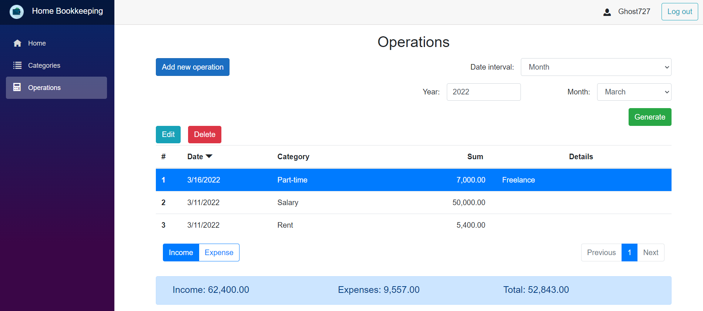

# Finance accounting Web API + Blazor Server
Backend (REST API) + Frontend (Blazor Server) of home finance accounting application. Allows you to keep track of your income and expenses, as well as build reports for a specified period.

## Table of Contents
* [General Info](#general-information)
* [Technologies Used](#technologies-used)
* [Features](#features)
* [Screenshots](#screenshots)
* [Contact](#contact)

## General Information
- The application allows you to create your own account and add, delete and update income and expense categories and operations.
- In addition, the application allows you to build reports for the selected period.
- When you create an account you can add base income/expense categories.
- No need to re-enter login and password at subsequent logins by using a refresh token.
- Ability to order by columns and pagination has been implemented.

## Technologies Used
- ASP.NET Core - version 5.0
- Blazor Server - version 5.0
- Entity Framework Core - version 5.0
- Identity and access control
- Authentication and authorization using JWT and Refresh tokens
- Swagger
- Automapper
- FluentValidation
- MediatR
- NLog
- SignalR
- Blazored.LocalStorage - version 4.2
- Bootstrap - version 5.1
- xUnit + Moq + FluentAssertions

## Features
List the ready features here:
- Onion architecture
- MVC and CQRS pattern
- Facade and Strategy patterns
- Asynchronous execution
- Using refresh tokens for renewing access tokens
- Integration tests to check tokens generation and validation
- Swagger documentation
- API versioning implemented
- Exception handling middleware
- Server side and client side validation
- Sorting records by column and records pagination

## Screenshots

## Contact
Created by [@Dmitriy Bulynko](https://linkedin.com/in/дмитрий-булынко-10bb53227) - feel free to contact me!
